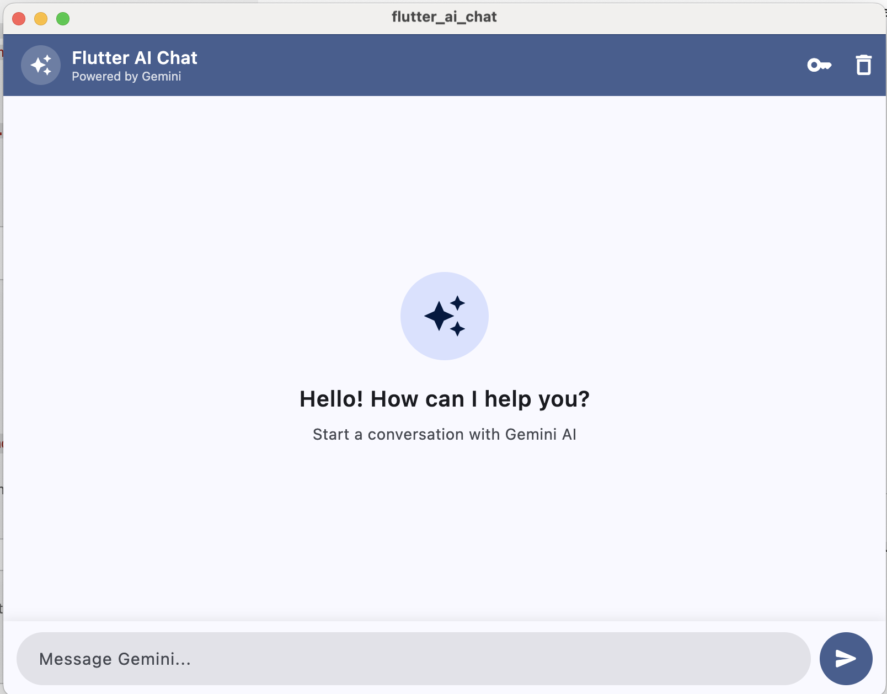

# Flutter AI Chat

A conversational AI chatbot built with Flutter and powered by the Google Gemini API. Features a clean Material Design 3 chat interface with multi-turn conversation support.

## Features

- 💬 Real-time chat UI with message bubbles
- 🤖 Google Gemini AI integration with multi-turn context
- ⌨️ Animated typing indicator while waiting for response
- 🔑 In-app API key management — no code changes needed
- ⚠️ Smart error handling for quota and auth failures
- 🎨 Material Design 3 with a clean modern look

## Screenshots



## Getting Started

### Prerequisites

- Flutter SDK (3.0+)
- A Google Gemini API key — get one free at [Google AI Studio](https://aistudio.google.com/app/apikey)

### Installation

1. **Clone the repo**
   ```bash
   git clone https://github.com/YOUR_USERNAME/flutter_ai_chat.git
   cd flutter_ai_chat
   ```

2. **Install dependencies**
   ```bash
   flutter pub get
   ```

3. **Run the app**
   ```bash
   flutter run
   ```

4. **Enter your API key**
   On first launch, a dialog will appear asking for your Gemini API key. Paste it in and tap **Save & Continue**. You can update it anytime using the key icon in the top-right corner.

## Project Structure

```
lib/
├── main.dart                  # App entry point
├── config.dart                # API endpoint configuration
├── models/
│   └── chat_message.dart      # ChatMessage data model
├── services/
│   └── gemini_service.dart    # Gemini API integration
├── screens/
│   └── chat_screen.dart       # Main chat screen
└── widgets/
    ├── send_button.dart        # Send button widget
    └── typing_dots.dart        # Animated typing indicator
```

## Built With

- [Flutter](https://flutter.dev/) — UI framework
- [Google Gemini API](https://ai.google.dev/) — AI language model
- [http](https://pub.dev/packages/http) — HTTP client

## License

This project is open source and available under the [MIT License](LICENSE).
